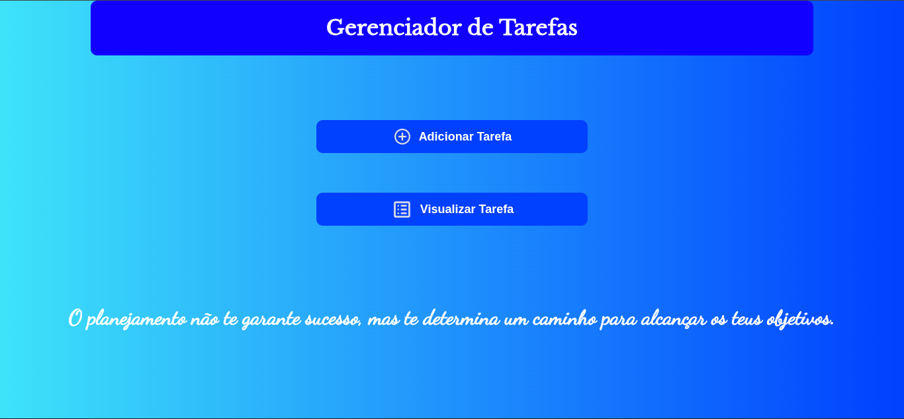

# Gerenciador de Tarefas Online

Este projeto trata-se de um gerenciador de tarefas criado com um propósito de auxiliar na organização das tarefas diárias ou mensais.

<a href="https://lista-de-tarefas-chi-seven.vercel.app/">Sistema de Gerenciamento de Tarefas</a>

## Descrição

Por mais simples que se possa parecer, a tecnologia por trás deste gerenciador é bastante facinante. Seu eficiente armazenamento através do navegador, permite que as tarefas cadastradas não sejam exclusas em caso de encerramento do navegador sem necessidade maior de um banco de dados para armazenar informações.

## Tecnologias Utilizadas:

<ul style="list-style: none; padding: 0; margin-bottom: 30px;">
  <li style="display: flex; align-items: center; margin-bottom: 12px;">
    
    <strong>HTML</strong>
  </li>
  <li style="display: flex; align-items: center; margin-bottom: 12px;">
    
    <strong>CSS</strong>
  </li>
  <li style="display: flex; align-items: center; margin-bottom: 12px;">
    
    <strong>JavaScript</strong>
  </li>
</ul>
